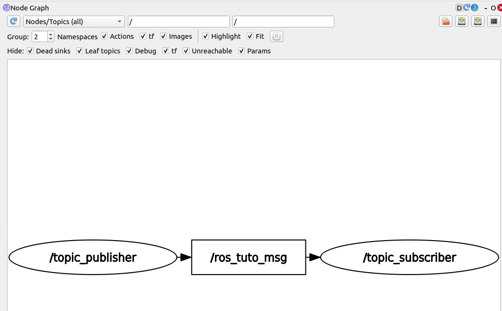
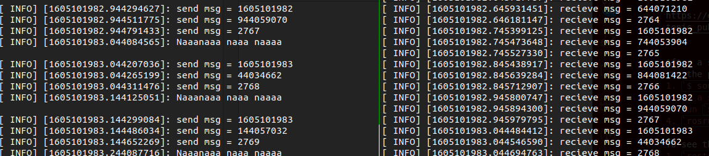

tutorial used for this 
https://github.com/ROBOTIS-GIT/ros_seminar/blob/master/07_Basic_ROS_Programming.pdf

https://github.com/ROBOTIS-GIT/ros_tutorials/blob/master/ros_tutorials_topic/src/topic_publisher.cpp

Topic subscriber is much like a radio broadcast and you have "people" listening
to the broadcast

After a successful `$ catkin_make`
run the program by doing 
1. `$ source devel/setup.bash` 
2. in a septrate terminal run `$ roscore`
3. run `$ rosrun publisher_subscriber topic_publisher`
4. `rosrun publisher_subscriber topic_subscriber`

To see the topic publised do 
1. `rostopic list`
2. `rostopic echo /ros_tuto_msg
3. u will see smth like this 
   `stamp:
  secs: 1605100964
  nsecs: 978359587
  data: 4487  
    `
4. run `rqt &` and from plugins choose node graph to see the nodes

if you run both the publisher and subscriber you should see the log messages for both as well as this in the node graph 

The image below the left is the publisher and the right is the subscriber

