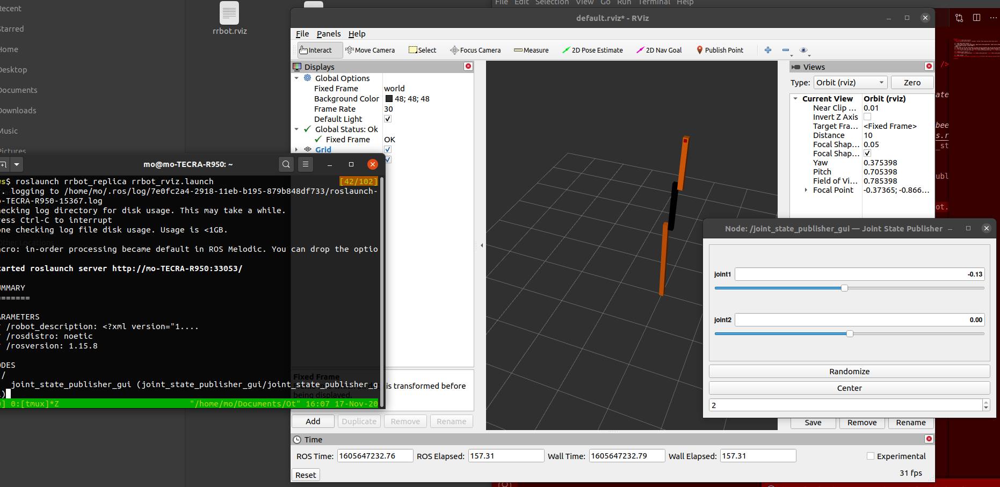

This is a replica for the gazebo website tutorial set for creating and controlling the rrbot
http://gazebosim.org/tutorials/?tut=ros_urdf
control segment is right here http://gazebosim.org/tutorials?tut=ros_control

And the plan is to go a step ahead and add a joint following this tutorial
https://github.com/JoshMarino/gazebo_and_ros_control


Working RVIZ with the command

```
roslaunch rrbot_replica rrbot_rviz.launch
```


Launch Gazebo with this command 

```
roslaunch rrbot_replica rrbot_world.launch
```

Launch the controller 

```
 roslaunch rrbot_replica rrbot_control.launch
```

We can control the gazebo sim as we see below


_NOTE_ the control only works if gazebo world has already been started, so run the world launch then the control launch. Rviz doenst work nicely with them so dont open it. The gazebo is the node that publishes the joints data and Rviz cant deal with that here (maybe u can debug and have them work tgather later) if you wanna use Rviz use the fake joints state publisher

# Troubleshooting

Sometimes it doesnt work so you have to reset everything by doing 
```
sudo killall rosmaster
sudo killall gzserver
sudo killall gzclient
```
 and make sure to do `catkin_make` then `source devel/setup.bash` 

 You can see that my python script does publish a sine input signal which makes the robot go crazy the image shows one frame but it actually moves a lot
 
