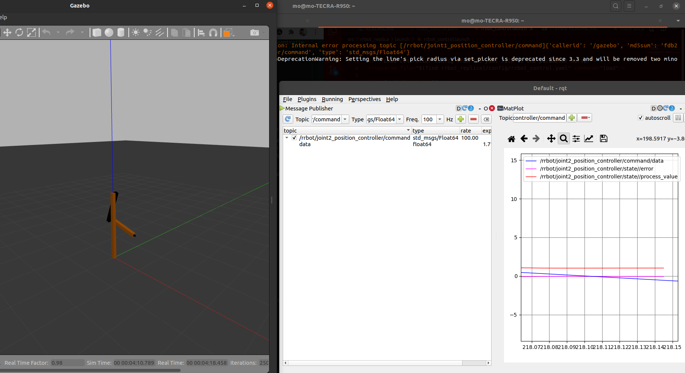

This is a replica for the gazebo website tutorial set for creating and controlling the rrbot
http://gazebosim.org/tutorials/?tut=ros_urdf
control segment is right here http://gazebosim.org/tutorials?tut=ros_control

And the plan is to go a step ahead and add a joint following this tutorial
https://github.com/JoshMarino/gazebo_and_ros_control


Working RVIZ with the command

```
roslaunch rrbot_replica rrbot_rviz.launch
```


Launch Gazebo with this command 

```
roslaunch rrbot_replica rrbot_world.launch
```

Launch the controller 

```
 roslaunch rrbot_replica rrbot_control.launch
```

We can control the gazebo sim as we see below



# Troubleshooting

Sometimes it doesnt work so you have to reset everything by doing 
```
sudo killall rosmaster
sudo killall gzserver
sudo killall gzclient
```
 and make sure to do `catkin_make` then `source devel/setup.bash` 