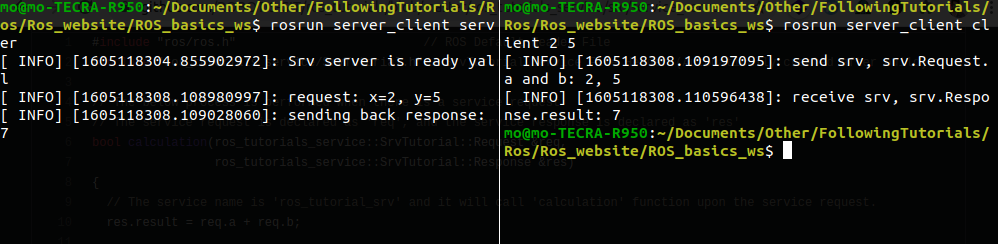
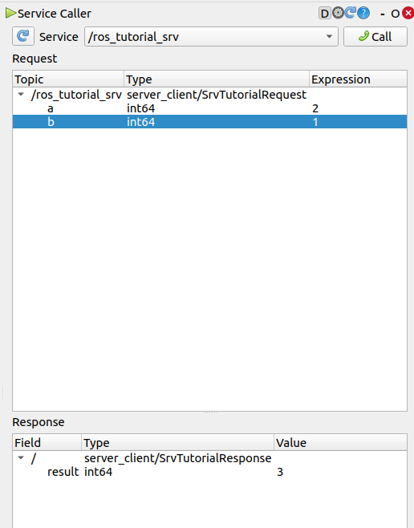

Server client action in ROS

note that 
The /devel/include/ros_tutorials_service folder contains message header files that
are automatically generated from the message files

to get this package working (assuming it is already builts with catkin_make)
1. `source devel/setup.bash`
2. `rosrun server_client server`
3. `rosrun server_client client`

We can also call the service like this 
`
$ rosservice call /ros_tutorial_srv 10 2
result: 12
`

This is a screen of it running 

and here it is from rqt window
 